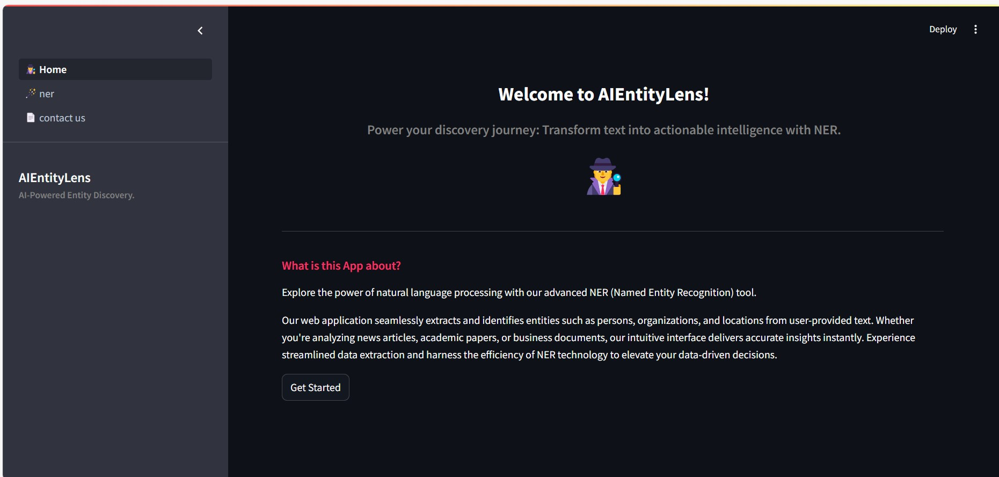
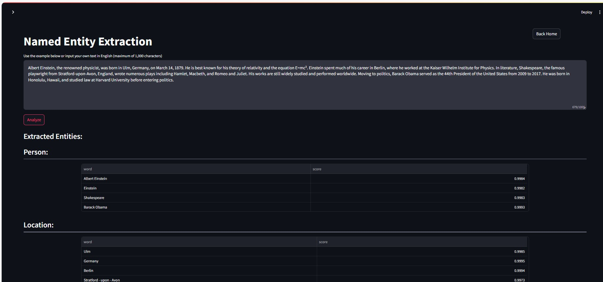
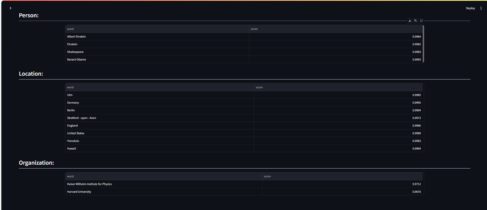

# AIEntityLens

AIEntityLens is a Streamlit-based application for extracting Named Entity Recognition (NER) entities from provided text inputs. It leverages NLP models to identify and categorize entities such as persons, organizations, locations, dates, and more.

## Features

- **Text Input**: Enter or paste text into the application to analyze.
- **NER Extraction**: Utilizes NLP techniques to extract named entities from the input text.
- **Interactive Visualization**: Displays extracted entities in an interactive and user-friendly format.
- **Customizable**: Options to refine analysis parameters or choose different NLP models.

## Technologies Used

- Streamlit: Web framework for creating interactive web applications with Python.
- Spacy: NLP library used for Named Entity Recognition.
- Python: Programming language used for application logic and integration.

## Installation

1. Clone the repository:

   ```bash
   git clone https://github.com/dharmikm9/AIEntityLens.git
   cd AIEntityLens

2. Install dependencies:
 ```bash
   pip install -r requirements.txt
  ````

3. Run the application:
   ```bash
   streamlit run 1_🕵️_Home.py
   ```

4. Open your web browser and go to http://localhost:8501 to view the AIEntityLens application.


## Usage
- Enter or paste text into the text input area.
- Click on the "Analyse" button to initiate the NER extraction process.
- View the extracted entities categorized by type (e.g., persons, organizations).

## Demo




## Contributing
Contributions are welcome! For major changes, please open an issue first to discuss what you would like to change.

1. Fork the repository.
2. Create your feature branch (git checkout -b feature/AmazingFeature).
3. Commit your changes (git commit -am 'Add some feature').
4. Push to the branch (git push origin feature/AmazingFeature).
5. Open a pull request.

## License
Distributed under the MIT License. See LICENSE for more information.

## Contact

LinkedIn: https://www.linkedin.com/in/dharmikm9

## Acknowledgements
- Streamlit Documentation
- HuggingFace
   
